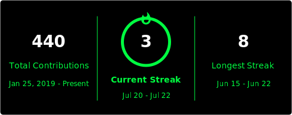

<h1 align="center">
  
</h1>

<p align="center">
  <a href="https://github.com/MuhammadHasbiAshshiddieqy"></a>
  <a href="https://www.linkedin.com/in/muhammadhasbiashshiddieqy/"></a>
  <a href="https://medium.com/@hsbdeveloper97"></a>
</p>

<p align="center">▓▓▓▓▓▓▓▓▓▓▓▓▓▓▓▓▓▓▓▓▓▓▓▓▓▓▓▓▓▓▓▓▓▓▓▓▓▓▓▓▓▓▓▓▓▓▓▓▓▓▓▓▓▓▓▓▓▓</p>

### `~/about-me $`

```bash
hasbi@dev:~$ whoami
Muhammad Hasbi Ashshiddieqy

hasbi@dev:~$ cat mission.txt
> Build a meaningful, governance-native AI startup

hasbi@dev:~$ ls learning/
software-engineering/   artificial-intelligence/

hasbi@dev:~$ cat open-to.txt
👯 Open to AI project collaborations

hasbi@dev:~$ echo $FUN_FACT
⚡ I love pizza and learning new things
```

<p align="center">▓▓▓▓▓▓▓▓▓▓▓▓▓▓▓▓▓▓▓▓▓▓▓▓▓▓▓▓▓▓▓▓▓▓▓▓▓▓▓▓▓▓▓▓▓▓▓▓▓▓▓▓▓▓▓▓▓▓</p>

### `~/stack $ ls -la`

<p align="center">
  
  
  
  
  
  
  
  
  
  
  
  
</p>

<p align="center">▓▓▓▓▓▓▓▓▓▓▓▓▓▓▓▓▓▓▓▓▓▓▓▓▓▓▓▓▓▓▓▓▓▓▓▓▓▓▓▓▓▓▓▓▓▓▓▓▓▓▓▓▓▓▓▓▓▓</p>

### `~/stats $ fetch --github`

<p align="center">
  
</p>
<p align="center">
  
</p>
<p align="center">
  
</p>

<p align="center">▓▓▓▓▓▓▓▓▓▓▓▓▓▓▓▓▓▓▓▓▓▓▓▓▓▓▓▓▓▓▓▓▓▓▓▓▓▓▓▓▓▓▓▓▓▓▓▓▓▓▓▓▓▓▓▓▓▓</p>

<p align="center">
  
</p>

<p align="center">
  
</p>
